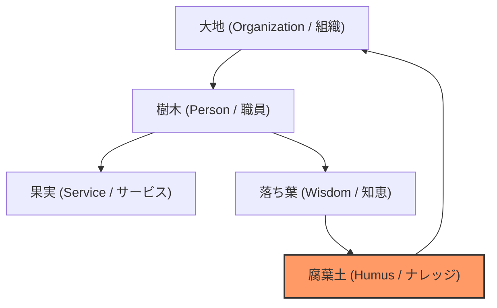

# 🦉 Project OWLight Concept Book Ver. 2.0
**～ 行政組織の「OS」を書き換える、組織変革プラットフォーム ～**

---

## 0. Proem: The Mirror Theory & The Fortress
### 鏡の法則、あるいは「要塞」としての組織論

> [!IMPORTANT]
> **「豊かな土壌からしか、美味しい果実は育たない。そして、守られていない城からは、誰も出撃できない。」**

我々日本の行政組織は、ある一つの「致命的な間違い」を犯し続けてきました。それは、「市民サービス（果実）」の品質向上ばかりを声高に叫び、それを実らせるために不可欠な「現場の環境（土壌）」の疲弊を、見て見ぬふりをしてきたことです。

DX、BPR、働き方改革。言葉は美しく踊ります。しかし、現場の実態はどうでしょうか。 定員削減で職員は減り、法令は年々複雑怪奇になり、頼れるベテランは大量退職で去っていきます。残された若手職員は、正解のない業務と過大な責任に震えています。窓口でのたらい回し、冷たい対応、事務処理の遅延。これらは個人の資質の問題ではありません。ナレッジがなく、余裕がなく、孤独に追い詰められた職員が、どうして市民に心から寄り添うことができるでしょうか？

現場を知る我々は、残酷な真実を断言します。
**「余裕のない職員は、市民に優しくなれない。」**

Project OWLight（アウライト）は、単なる業務効率化ツールではありません。徹底的に**「職員（Internal）」を守るために生まれた、組織変革のプラットフォーム**です。
しかし、それは「甘やかす」ことではありません。職員を、不当な批判や、理不尽な業務量、そして「孤独」というリスクから守るための**「デジタルな要塞（Fortress）」**を構築することです。

システムに使われるのではなく、システムがあなたを守る。
OWLightは、堅苦しい「ガバナンス（統制）」を、温かい「おもてなし（サポート）」の技術で包み込みます。職員が迷いをなくし、時間を返し、公務員としての誇りを取り戻すことこそが、市民に最高品質のサービスを届けるための、遠回りのようで「唯一の近道」なのです。

---

## 1. User Experience: A Day with OWLight
### 1日の「物語（Narrative）」を再設計する

OWLightと共に過ごす1日は、単なる労働時間ではなく、一つの「物語」としてデザインされています。マニュアルに基づき、職員のメンタル状態（Resilience）を守り、高めるための**「5つのフェーズ」**を実装します。

#### 【Phase 1】 Morning Ritual: The Priming
**出勤直後、仕事モードへの「心」のスイッチを入れる。**

*   **The Problem:** 満員電車や家庭の事情を引きずったまま、いきなりメールの波に飲まれ、受動的な「消化試合」として1日が始まる。
*   **The Solution:** **Value Cards (価値観カード)**
    ログイン時、Mr.OWL（フクロウのアバター）が問いかけます。
    1. 「今日、あなたが一番大切にしたい『価値』はなんですか？」
    2. 画面には3枚のカード（誠実さ、挑戦、優しさ）が提示されます。
*   **Behavioral Logic (プライミング効果):** カードを選び、「暁の誓い」ボタンを押すことで、職員は無意識のうちにその日の行動指針（アンカー）をセットします。「やらされる仕事」から「自ら選んだスタンス」へと、主導権を取り戻す儀式です。

#### 【Phase 2】 Personal Dashboard: The Wisdom Forest
**業務開始前、自分の「貢献」と「繋がり」を確認し、自己肯定感を満たす。**

*   **The Problem:** 自分の仕事が誰の役に立っているのか見えない徒労感。
*   **The Solution:** **Visualized Impact**
    - **Owl Avatar:** 自身の貢献度に応じて、フクロウの姿が知的に変化。
    - **Wisdom Point & Time Saved:** 数値だけでなく、「あなたの知恵により、組織全体で約45時間が節約されました」という**「守った時間」**を表示。
    - **Thanks Network (感謝の輪):** 関係性の広がりを可視化し、孤独感を払拭。
    - **Shadow CV (裏履歴書):** 人事評価シートには載らない**「徳」**の履歴を表示。

#### 【Phase 3】 Work Overlay: The Fortress & Cockpit
**執務中、既存システムの上に「守護霊」として常駐する。**

OWLightは、財務会計システムなどの既存画面の上に**オーバーレイ（重ねて表示）**され、実務をリアルタイムで支援します。

*   **DAP Guide (デジタル・アダプション):** 専門用語にカーソルを合わせるだけで平易な言葉で解説を表示。
*   **Guardian Mode (ガーディアン・ブロック):** 重大なミスの予兆を検知した瞬間、画面が暗転し全画面警告を表示。物理的に「実行不可能」にすることで、職員を「加害者」になることから守ります。
*   **Karma Stamina (ノブレス・オブリージュ):** ベテランがAIを使う際に「徳（スタミナ）」を消費。部下への助言やナレッジ投稿で回復させることで、**「教えないと自分が損をする」**状況を創出します。

#### 【Phase 4】 Sanctuary Protocol: The Safety Net
**限界を迎える前の、精神的な「安全地帯」。**

*   **The Problem:** 「もう無理」「誰にも言えないミスをした」という極限状態での孤立。
*   **The Solution:**
    - **Sanctuary Widget (隠れ家チャット):** 通常の業務ログには残らない、AIとの受容的な対話空間。
    - **SOS Beacon (⚡マーク):** 匿名のSOSを信頼できるシニア職員に通知。解決後、ログは消滅。
*   **Logic:** 社会的・心理的コストを極限まで下げることで、重篤な事故を「予兆」段階で防ぎます。

#### 【Phase 5】 Closing Ritual: The Digital Sunset
**退勤時、脳をポジティブな状態で終わらせ、安らかなプライベートへ送る。**

*   **The Problem:** 未完了感（ツァイガルニク効果）を引きずり、家でも心が休まらない。
*   **The Solution:**
    - **Visualization:** その日の貢献度（ポイント）と「承認」スタンプを可視化。
    - **Reflection:** 今日の成果を一言で振り返る。
    - **Ending:** "It's All Right." の文字と共に業務を終了し、気持ちを切り替えます。
*   **Behavioral Logic (ピーク・エンドの法則):** 1日の最後を「他者への貢献」の確認で締めくくり、記憶をポジティブに上書きします。

---

## 2. Vision: From Factory to Forest Ecosystem
### 組織の定義を、「消耗する工場」から「循環する森」へ書き換える。

これまで行政組織は、職員を「交換可能な部品」として扱う**「工場（Factory）」**のモデルで運営されてきました。このサイクルでは、組織は3年ごとの異動のたびに「記憶喪失」にかかり、いつまでたっても賢くなれません。

OWLightは、行政組織を**「森（Forest）」**という、自律的な生態系として再定義します。

*   **Organization（大地）:** 痩せた土地では、どんなに優秀な種（新人）も育ちません。
*   **Person（樹木）:** 職員は大地の上で育ち、果実（サービス）を届けます。
*   **Wisdom（腐葉土）:** 職員の日々の工夫やメモ（落ち葉）を、AIが吸収・分解し、豊かな腐葉土へと変えて大地に還します。

**「あなたが落とした苦労は、一枚たりとも無駄にはしない。」**

---

## 3. Strategy: The 5:15:80 Rule & Implicit Gamification
### 全員参加を目指さない。5%の「神」と、賢い「仕掛け」で回す。

*   **Top 5% (The Givers - 神):** 「教え好き」なキーマン。彼らを徹底的に称賛し、地位（Status）を与えることに集中。
*   **Middle 15% (The Supporters):** 感謝ボタンや微修正を行う層。
*   **Bottom 80% (The Takers):** 検索・閲覧のみ。彼らに投稿は強要しません。

OWLightは、LinkedInのようなプロフェッショナルな外観の裏で、ドーパミン（興奮）よりもオキシトシン（絆）を重視する**「隠れゲーミフィケーション（Implicit Gamification）」**を実装します。

---

## 4. Value Proposition: The 4 Lanterns
### 組織内の異なる立場の職員それぞれに、最適な「光」を与える。

| 対象 | メッセージ | 主要機能 |
| :--- | :--- | :--- |
| **新規採用職員** | 「24時間、最強の同期がいる。」 | 24h AIメンター、無限のスタミナ（質問コストゼロ） |
| **ベテラン・係長** | 「見えない貢献を資産化する。」 | Legacy Tree（知恵の樹）、Manager Console（AI参謀） |
| **経営層・議会** | 「投資の正当性を証明する。」 | ROI Translator（節約時間の可視化）、AI Censor（検閲） |
| **情報システム** | 「既存システムを保護する。」 | DAP Overlay、Guardian Shield |

---

## 5. Product Architecture: The Administrative Spinal Cord
### 行政組織の「脊髄」となる、行動科学に基づいた実装

1.  **Opt-out Posting (怠惰のハック)**
    「このログは3日後に自動公開されます。公開したくない場合のみ『拒否』を押してください」というデフォルト設定により、怠惰を逆手に取りナレッジを蓄積します。
2.  **Tribute Input Model (代筆による資産化)**
    「助けられた若手」が先輩の教えを入力。ベテランは手間なく称賛を得られ、組織にはナレッジが残ります。
3.  **Tiered Authority (情報の権威付け)**
    回答に信頼度バッジ（Tier 1:公式 / Tier 2:推奨 / Tier 3:未検証）を付与し、行政事故を防ぎます。

---

## 6. Closing: Founder's Soul
### 20年間の葛藤と、たどり着いた「静かなる革命」。

行政に必要なのは「効率」だけではありません。**「文脈」と「優しさ」、そして「誇り（Pride）」**です。
OWLightは、一見すると落ち着いた業務ツールです。しかしその裏側には、利己的な動機を利他的な行動へと変換する緻密な計算（Behavioral Architecture）が埋め込まれています。

3年で記憶を失う組織を、一生助け合えるコミュニティへ。
OWLightは、行政という巨大な生命体の、**新しいOS**なのです。

---

## ➕ Appendix: Future Implementation Plan
初期リリース（MVP）以降に検討されている拡張機能です。

*   **Alumni Legacy Link:** 退職者（アルムナイ）と緩やかに繋がり、組織の境界を溶かす。
*   **Spec Generator:** 業者とのやり取りからシステム仕様書を逆設計。
*   **Talent Genome:** 「誰が誰の弟子か」などの高度な適性DNA分析。
